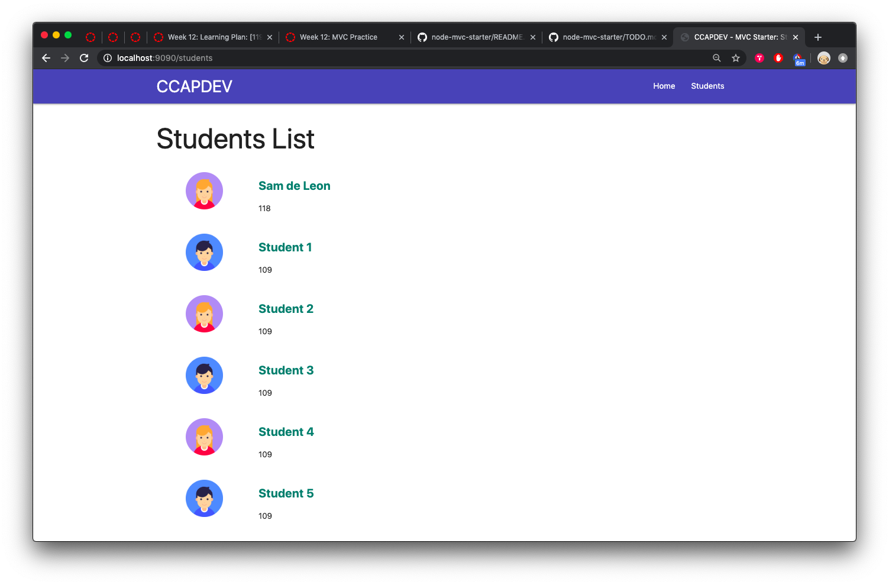
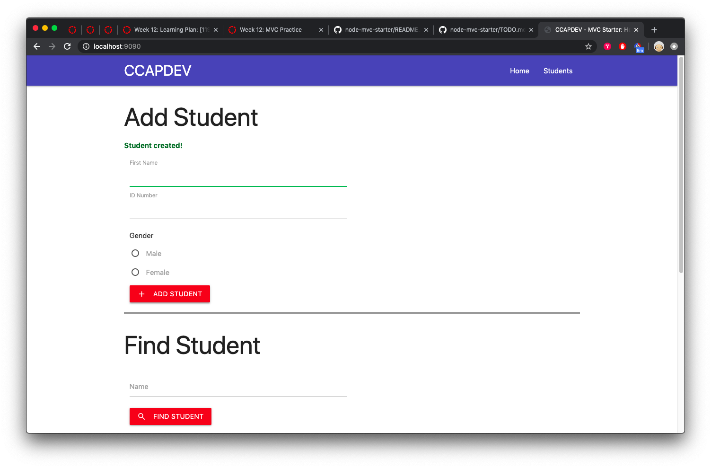
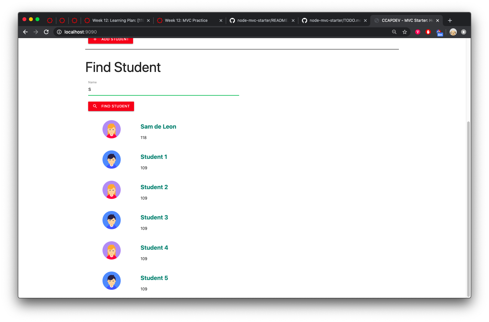

# Starter Code for Refactoring Node.js App to MVC

This is based off on the [`node-mongoose-sample`](https://github.com/unisse-courses/node-mongoose-sample) repository but using [Materialize](https://materializecss.com/) as the CSS design framework.

## Requirements
* [NodeJS & npm](https://www.npmjs.com/get-npm)
* [MongoDB Community Edition](https://docs.mongodb.com/manual/administration/install-community/) (Must be running in the background)
* [Postman](https://www.postman.com/) - To be able to test the endpoints
* Any text editor for JavaScript, HTML & CSS (VSCode, Atom, SublimeText, etc.)

## Pre-Setup
1. Fork this repository by clicking the Fork button up at the top of this page.
2. Clone **your copy** of the repository `git clone https://github.com/<YOUR_USERNAME>/node-mvc-starter.git`

**_Optional Steps to sync forked repo with orginal_**
To keep your version synced with any changes that might be added in the original repository, follow this [GitHub tutorial](https://help.github.com/en/github/getting-started-with-github/fork-a-repo).

## Running locally
1. Navigate to the directory: `cd node-mvc-starter`
2. Install the dependencies: `npm install`
3. Run the server: `npm run dev`
    - This is using [`nodemon`](https://github.com/remy/nodemon#nodemon) to be able to watch for any changes in the application and restart the server automatically
    - The command `npm run <script>` looks at [`package.json`](package.json) for the name of the command to be run under the `"scripts"` config.

4. Navigate to [http://localhost:9090/](http://localhost:9090/) and the screen should look like this:
    

## What to do
Follow the video uploaded on Canvas. Step by step instructions are also in [`TODO.md`](TODO.md).

# Refactored Node.js App for MVC

Name: de Leon, Samantha Isabelle F.

## View All Students

## Add Student

## Search Students

